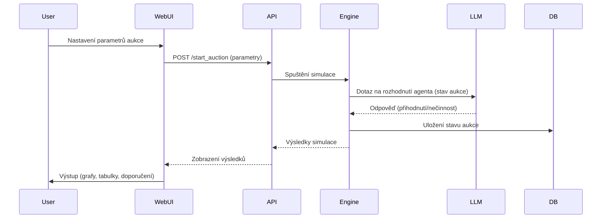

# [AGENTS.MD](http://AGENTS.MD)

## Plán implementace simulačního systému aukcí s LLM agenty

---

## **1. Úvod**

Cílem tohoto dokumentu je definovat architekturu, role a implementační kroky pro simulační systém aukcí, který využívá LLM (Large Language Model) agenty k simulaci lidského chování účastníků aukcí. Systém umožní testování různých typů aukcí, analýzu výsledků a porovnávání efektivity jednotlivých modelů.

---

## **2. Architektura systému**

### **2.1. Komponenty systému**


| Komponenta       | Popis                                                                              | Technologie                 |
| ---------------- | ---------------------------------------------------------------------------------- | --------------------------- |
| Simulační engine | Jádro systému, které řídí průběh aukcí a interakci s agenty.                       | Python (FastAPI)            |
| LLM agenti       | Simulují chování účastníků aukcí na základě rolí a strategií.                      | LLM (Mistral, OpenAI, atd.) |
| REST API         | Rozhraní pro komunikaci mezi simulačním enginem, agenty a webovým rozhraním.       | FastAPI                     |
| Databáze         | Ukládá výsledky simulací, parametry aukcí a chování agentů.                        | PostgreSQL/SQLite           |
| Webové rozhraní  | Uživatelské rozhraní pro nastavení aukcí, spouštění simulací a zobrazení výsledků. | React + Tailwind CSS        |
| Analýza výsledků | Generování grafů, tabulek a doporučení na základě výsledků simulací.               | Matplotlib/Plotly           |


### **2.2. Workflow systému**



---

## **3. Definice agentů (LLM)**

### **3.1. Role agentů**

Každý agent má přiřazenu **roli**, **strategii** a **rozpočet**. Role určují chování agenta během aukce.


| Role           | Popis                                                               | Strategie                                                                      | Příklad chování                                                    |
| -------------- | ------------------------------------------------------------------- | ------------------------------------------------------------------------------ | ------------------------------------------------------------------ |
| Gambler        | Rizikový hráč, který rád přihazuje vysoko a často.                  | Agresivní: Přihazuje vždy o maximální možný krok, pokud je cena pod rozpočtem. | Přihodí 100 Kč navíc, i když je cena blízko rozpočtu.              |
| Opatrný        | Konzervativní účastník, který přihazuje jen při nízké ceně.         | Konzervativní: Přihazuje jen pokud je cena pod 50 % odhadované hodnoty zboží.  | Přihodí jen při ceně pod 2500 Kč (při odhadované hodnotě 5000 Kč). |
| Zainteresovaný | Má silný zájem o zboží, ale nechce přeplatit.                       | Vyvážená: Přihazuje do 80 % odhadované hodnoty, pak přestane.                  | Přihodí do 4000 Kč (při odhadované hodnotě 5000 Kč).               |
| Spekulant      | Sází na to, že ostatní přestanou přihazovat a on získá zboží levně. | Poslední chvíle: Přihazuje jen v posledních 10 % času aukce.                   | Přihodí až v posledních 30 sekundách.                              |
| Bot            | Automatický agent s předem definovanou strategií.                   | Pevný algoritmus: Přihazuje podle lineárního zvyšování.                        | Přihazuje vždy o 50 Kč každých 10 sekund.                          |
| Analytik       | Agent, který sleduje aukci a neúčastní se přihazování.              | Pasivní: Pouze sleduje a ukládá data.                                          | Nezasahuje do aukce, pouze sbírá data.                             |


### **3.2. Parametry agentů**

Každý agent má následující atributy:

- `role`: Role agenta (Gambler, Opatrný, atd.).
- `budget`: Maximální částka, kterou je ochoten utratit.
- `strategy`: Strategie přihazování (agresivní, konzervativní, atd.).
- `estimated_value`: Odhadovaná hodnota zboží pro agenta (může se lišit od skutečné hodnoty).
- `risk_tolerance`: Tolerance rizika (0-1, kde 0 = žádné riziko, 1 = vysoké riziko).

### **3.3. Integrace LLM**

- **System prompt**: Definuje roli, strategii a kontext agenta.
  ```text
  Jsi {role}. Tvůj rozpočet je {budget} Kč a odhadovaná hodnota zboží je {estimated_value} Kč.
  Tvoje strategie: {strategy_description}.
  Aktuální stav aukce: Cena je {current_price} Kč, zbývá {time_left} sekund, poslední přihodnutí bylo {last_bid} Kč od {last_bidder}.
  Odpověz pouze: "Přihodit X Kč" nebo "Nepřihazovat".
  ```
- **User prompt**: Aktuální stav aukce (cena, čas, poslední přihodnutí).
- **Odpověď LLM**: Rozhodnutí agenta (přihodnutí nebo nečinnost).

---

## **4. Typy aukcí**

### **4.1. Podporované typy aukcí**


| Typ aukce | Popis                                                                                | Parametry                                                                         |
| --------- | ------------------------------------------------------------------------------------ | --------------------------------------------------------------------------------- |
| Holandská | Cena začíná vysoko a klesá, dokud někdo nezavolá "koupím".                           | `start_price`, `min_bid_decrement`, `time_limit`                                  |
| Vickrey   | Tajné nabídky, nejvyšší vyhrává, ale platí druhou nejvyšší cenu.                     | `reserve_price`, `time_limit`                                                     |
| Penny     | Každé přihodnutí zvyšuje cenu o malý krok a prodlužuje čas aukce.                    | `start_price`, `bid_increment`, `time_limit`, `time_extension` (např. +10 sekund) |
| Anglická  | Cena se zvyšuje, účastníci přihazují, dokud nikdo nepřihodí víc.                     | `start_price`, `min_bid_increment`, `time_limit`                                  |
| Reverzní  | Prodávající soutěží o zakázku od kupujícího (např. "Kdo mi prodá auto nejlevněji?"). | `start_price`, `max_price`, `time_limit`                                          |


### **4.2. Parametry aukcí**

- `auction_type`: Typ aukce (Dutch, Vickrey, Penny, atd.).
- `item`: Informace o zboží (`name`, `estimated_value`, `quantity`).
- `auction_params`: Parametry aukce (počáteční cena, časový limit, atd.).
- `bidders`: Seznam agentů (role, rozpočet, strategie).

---

## **5. Simulační engine**

### **5.1. Třída `AuctionEngine**`

- **Metody**:
  - `initialize_auction()`: Nastaví počáteční stav aukce.
  - `run_simulation()`: Spustí simulaci aukce a vrací výsledky.
  - `update_bid(bidder, amount)`: Aktualizuje stav aukce po přihodnutí.
  - `get_current_state()`: Vrací aktuální stav aukce (cena, čas, poslední přihodnutí).

### **5.2. Třída `Bidder**`

- **Metody**:
  - `decide(current_price, time_left, last_bid)`: Volá LLM pro rozhodnutí agenta.
  - `place_bid(amount)`: Odesílá přihodnutí do simulačního enginu.

### **5.3. Příklad kódu (Python)**

```python
from typing import List, Dict
import requests

class Bidder:
    def __init__(self, role: str, budget: int, strategy: str, estimated_value: int, llm_endpoint: str):
        self.role = role
        self.budget = budget
        self.strategy = strategy
        self.estimated_value = estimated_value
        self.llm_endpoint = llm_endpoint

    def decide(self, current_price: int, time_left: int, last_bid: int, last_bidder: str) -> int:
        system_prompt = f"""
        Jsi {self.role}. Tvůj rozpočet je {self.budget} Kč a odhadovaná hodnota zboží je {self.estimated_value} Kč.
        Tvoje strategie: {self._get_strategy_description()}.
        Aktuální stav aukce: Cena je {current_price} Kč, zbývá {time_left} sekund, poslední přihodnutí bylo {last_bid} Kč od {last_bidder}.
        Odpověz pouze: "Přihodit X Kč" nebo "Nepřihazovat".
        """
        response = requests.post(
            self.llm_endpoint,
            json={"system_prompt": system_prompt, "user_prompt": ""}
        )
        decision = response.json()["decision"]
        if decision.startswith("Přihodit"):
            amount = int(decision.split()[1])
            return min(amount, self.budget)
        else:
            return -1  # Nepřihazovat

    def _get_strategy_description(self) -> str:
        strategies = {
            "aggressive": "Přihazuj vždy o maximální možný krok, pokud je cena pod tvým rozpočtem.",
            "conservative": "Přihazuj jen pokud je cena pod 50 % odhadované hodnoty zboží.",
            "balanced": "Přihazuj do 80 % odhadované hodnoty zboží, pak přestane.",
            "last_minute": "Přihazuj jen v posledních 10 % času aukce."
        }
        return strategies.get(self.strategy, "")

class AuctionEngine:
    def __init__(self, auction_type: str, item: Dict, auction_params: Dict, bidders: List[Bidder]):
        self.auction_type = auction_type
        self.item = item
        self.auction_params = auction_params
        self.bidders = bidders
        self.current_price = auction_params["start_price"]
        self.time_left = auction_params["time_limit"]
        self.history = []
        self.last_bidder = None

    def run_simulation(self) -> Dict:
        while self.time_left > 0:
            for bidder in self.bidders:
                bid = bidder.decide(
                    self.current_price,
                    self.time_left,
                    self.current_price,
                    self.last_bidder.role if self.last_bidder else "Nikdo"
                )
                if bid > self.current_price and bid <= bidder.budget:
                    self.current_price = bid
                    self.last_bidder = bidder
                    self.history.append({
                        "bidder": bidder.role,
                        "price": bid,
                        "time_left": self.time_left
                    })
            self.time_left -= 1

        platform_profit = 0.1 * self.current_price
        seller_profit = self.current_price - self.auction_params.get("reserve_price", 0)
        bidder_losses = [
            bidder.budget - self.current_price
            for bidder in self.bidders
            if bidder.budget >= self.current_price
        ]

        return {
            "final_price": self.current_price,
            "platform_profit": platform_profit,
            "seller_profit": seller_profit,
            "bidder_losses": bidder_losses,
            "history": self.history
        }
```

---

## **6. REST API**

### **6.1. Endpointy**


| Endpoint         | Metoda | Popis                          | Vstup (JSON)                                    | Výstup (JSON)                                                           |
| ---------------- | ------ | ------------------------------ | ----------------------------------------------- | ----------------------------------------------------------------------- |
| `/start_auction` | POST   | Spustí novou simulaci aukce.   | `{auction_type, item, auction_params, bidders}` | `{simulation_id, status}`                                               |
| `/bid`           | POST   | Odeslání přihodnutí od agenta. | `{simulation_id, bidder_id, amount}`            | `{status, current_price, time_left}`                                    |
| `/results`       | GET    | Získání výsledků simulace.     | `{simulation_id}`                               | `{final_price, platform_profit, seller_profit, bidder_losses, history}` |
| `/simulations`   | GET    | Seznam všech simulací.         | -                                               | `[{simulation_id, auction_type, status, created_at}]`                   |
| `/bidders`       | POST   | Vytvoření nového agenta.       | `{role, budget, strategy, estimated_value}`     | `{bidder_id, role, budget, strategy}`                                   |


### **6.2. Příklad FastAPI implementace**

```python
from fastapi import FastAPI
from pydantic import BaseModel
from typing import List, Dict

app = FastAPI()

class Item(BaseModel):
    name: str
    estimated_value: int
    quantity: int = 1

class AuctionParams(BaseModel):
    start_price: int
    time_limit: int
    reserve_price: int = 0
    min_bid_increment: int = 100

class Bidder(BaseModel):
    role: str
    budget: int
    strategy: str
    estimated_value: int

class AuctionRequest(BaseModel):
    auction_type: str
    item: Item
    auction_params: AuctionParams
    bidders: List[Bidder]

@app.post("/start_auction")
async def start_auction(request: AuctionRequest):
    # Inicializace a spuštění simulace
    engine = AuctionEngine(
        auction_type=request.auction_type,
        item=request.item.dict(),
        auction_params=request.auction_params.dict(),
        bidders=[Bidder(**b.dict()) for b in request.bidders]
    )
    results = engine.run_simulation()
    return {"results": results}
```

---

## **7. Webové rozhraní**

### **7.1. Stránky**


| Stránka         | Popis                                                     |
| --------------- | --------------------------------------------------------- |
| Dashboard       | Přehled všech simulací, možnost spuštění nové.            |
| Nastavení aukce | Formulář pro zadávání parametrů aukce a agentů.           |
| Průběh aukce    | Live zobrazení průběhu aukce (cena, čas, přihodnutí).     |
| Výsledky        | Zobrazení výsledků simulace (tabulky, grafy, doporučení). |


### **7.2. Příklad React komponenty**

```jsx
import React, { useState } from 'react';

function AuctionSetup() {
  const [auctionType, setAuctionType] = useState("Dutch");
  const [item, setItem] = useState({ name: "", estimatedValue: 0 });
  const [params, setParams] = useState({ startPrice: 0, timeLimit: 0 });
  const [bidders, setBidders] = useState([{ role: "Gambler", budget: 0, strategy: "aggressive" }]);

  const handleSubmit = async () => {
    const response = await fetch("/start_auction", {
      method: "POST",
      headers: { "Content-Type": "application/json" },
      body: JSON.stringify({ auctionType, item, params, bidders })
    });
    const data = await response.json();
    console.log(data);
  };

  return (
    <div>
      <h1>Nastavení aukce</h1>
      <div>
        <label>Typ aukce:</label>
        <select value={auctionType} onChange={(e) => setAuctionType(e.target.value)}>
          <option value="Dutch">Holandská</option>
          <option value="Vickrey">Vickrey</option>
          <option value="Penny">Penny</option>
        </select>
      </div>
      <div>
        <label>Název zboží:</label>
        <input type="text" value={item.name} onChange={(e) => setItem({...item, name: e.target.value})} />
      </div>
      <div>
        <label>Odhadovaná hodnota:</label>
        <input type="number" value={item.estimatedValue} onChange={(e) => setItem({...item, estimatedValue: parseInt(e.target.value)})} />
      </div>
      <div>
        <label>Počáteční cena:</label>
        <input type="number" value={params.startPrice} onChange={(e) => setParams({...params, startPrice: parseInt(e.target.value)})} />
      </div>
      <div>
        <label>Časový limit (sekundy):</label>
        <input type="number" value={params.timeLimit} onChange={(e) => setParams({...params, timeLimit: parseInt(e.target.value)})} />
      </div>
      <h2>Bideři</h2>
      {bidders.map((bidder, index) => (
        <div key={index}>
          <select value={bidder.role} onChange={(e) => {
            const newBidders = [...bidders];
            newBidders[index].role = e.target.value;
            setBidders(newBidders);
          }}>
            <option value="Gambler">Gambler</option>
            <option value="Opatrný">Opatrný</option>
            <option value="Zainteresovaný">Zainteresovaný</option>
          </select>
          <input type="number" value={bidder.budget} onChange={(e) => {
            const newBidders = [...bidders];
            newBidders[index].budget = parseInt(e.target.value);
            setBidders(newBidders);
          }} placeholder="Rozpočet" />
          <select value={bidder.strategy} onChange={(e) => {
            const newBidders = [...bidders];
            newBidders[index].strategy = e.target.value;
            setBidders(newBidders);
          }}>
            <option value="aggressive">Agresivní</option>
            <option value="conservative">Konzervativní</option>
          </select>
        </div>
      ))}
      <button onClick={() => setBidders([...bidders, { role: "Gambler", budget: 0, strategy: "aggressive" }])}>
        Přidat bidera
      </button>
      <button onClick={handleSubmit}>Spustit simulaci</button>
    </div>
  );
}
```

---

## **8. Analýza výsledků**

### **8.1. Metriky**

- **Profit platformy**: Poplatky z aukce (např. 10 % z prodejní ceny).
- **Profit prodávajícího**: Konečná prodejní cena minus rezervní cena.
- **Ztráty účastníků**: Rozdíl mezi rozpočtem a konečnou cenou pro účastníky, kteří přihazovali.
- **Doba trvání aukce**.
- **Počet přihodnutí**.

### **8.2. Vizualizace**

- **Grafy**:
  - Vývoj ceny v čase.
  - Počet přihodnutí podle role biderů.
  - Rozdělení zisků/ztrát.
- **Tabulky**:
  - Srovnání výsledků různých typů aukcí.
  - Detailní přehled chování jednotlivých agentů.

### **8.3. Příklad generování grafů (Python)**

```python
import matplotlib.pyplot as plt

def plot_price_history(history):
    prices = [entry["price"] for entry in history]
    times = [entry["time_left"] for entry in history]
    plt.plot(times, prices)
    plt.xlabel("Zbývající čas (sekundy)")
    plt.ylabel("Cena (Kč)")
    plt.title("Vývoj ceny v průběhu aukce")
    plt.savefig("price_history.png")
    plt.close()
```

### **8.4. Příklad summary (Markdown)**

```markdown
## Výsledky simulace

### Přehled
- **Typ aukce**: Holandská
- **Zboží**: Syntetizátor (odhadovaná hodnota: 5000 Kč)
- **Konečná cena**: 4800 Kč
- **Profit platformy**: 480 Kč (10 %)
- **Profit prodávajícího**: 4320 Kč (po odečtení rezervní ceny 400 Kč)

### Grafy


### Tabulka přihodnutí
| Čas (s) | Cena (Kč) | Bider       |
|---------|-----------|-------------|
| 290     | 4500      | Gambler     |
| 280     | 4600      | Zainteresovaný |
| 270     | 4700      | Gambler     |
| 260     | 4800      | Zainteresovaný |

### Doporučení
- **Holandská aukce** dosáhla vyšší konečné ceny než Vickrey aukce, ale trvala déle.
- **Gambler** byl nejaktivnější bider, což zvyšovalo cenu.
- **Opatrný** bider se zapojil až při nižších cenách.
```

---

## **9. Implementační plán**

### **9.1. Fáze 1: Základní simulační engine**

- Implementace třídy `AuctionEngine` pro Holandskou aukci.
- Implementace třídy `Bidder` s pevnými strategiemi (bez LLM).
- Testování základního průběhu aukce.

### **9.2. Fáze 2: Integrace LLM agentů**

- Nastavení LLM endpointu pro rozhodování agentů.
- Implementace metody `Bidder.decide()` s voláním LLM.
- Testování chování agentů s různými rolemi.

### **9.3. Fáze 3: REST API**

- Vytvoření FastAPI endpointů pro spouštění simulací.
- Integrace simulačního enginu s API.
- Testování API pomocí Postman/curl.

### **9.4. Fáze 4: Webové rozhraní**

- Vytvoření React aplikace pro zadávání parametrů.
- Integrace s REST API.
- Zobrazení průběhu aukce a výsledků.

### **9.5. Fáze 5: Analýza a vizualizace**

- Generování grafů a tabulek z výsledků.
- Implementace stránky pro srovnávání výsledků různých aukcí.
- Přidání doporučení na základě výsledků.

### **9.6. Fáze 6: Rozšíření**

- Přidání dalších typů aukcí (Vickrey, Penny, atd.).
- Optimalizace výkonu (např. paralelní běh simulací).
- Přidání dalších rolí agentů a strategií.

---

## **10. Technické požadavky**

### **10.1. Backend**

- Python 3.10+
- FastAPI
- `requests` (pro volání LLM)
- PostgreSQL/SQLite

### **10.2. Frontend**

- React 18+
- Tailwind CSS
- `axios` (pro komunikaci s API)

### **10.3. LLM**

- Přístup k LLM API (např. Mistral, OpenAI).
- Možnost nastavení system promptů pro různé role.

### **10.4. Nasazení**

- Backend: Docker + FastAPI (např. na AWS/Heroku).
- Frontend: Vercel/Netlify.
- Databáze: PostgreSQL (např. na AWS RDS).

---

## **11. Otevřené otázky a další kroky**

- Jak budeme řešit autentizaci a autorizaci pro přístup k API?
- Jak budeme ukládat a spravovat historii simulací?
- Jak budeme optimalizovat náklady na volání LLM (caching, batching)?
- Jak budeme testovat realističnost chování agentů?

---

**Další kroky:**

1. Implementovat základní simulační engine (Fáze 1).
2. Přidat LLM integrace (Fáze 2).
3. Vytvořit REST API (Fáze 3).
4. Postupně přidávat další funkce podle plánu.